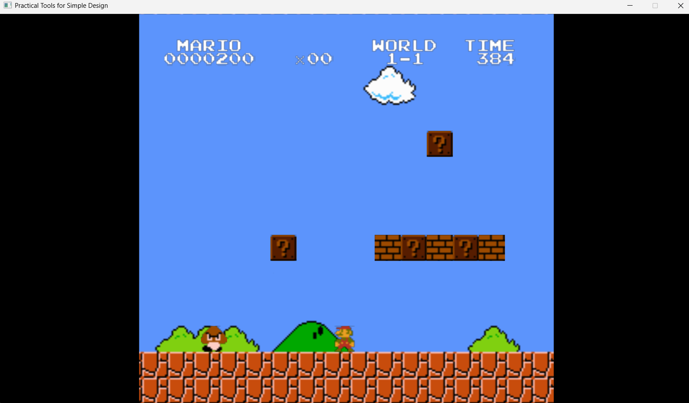
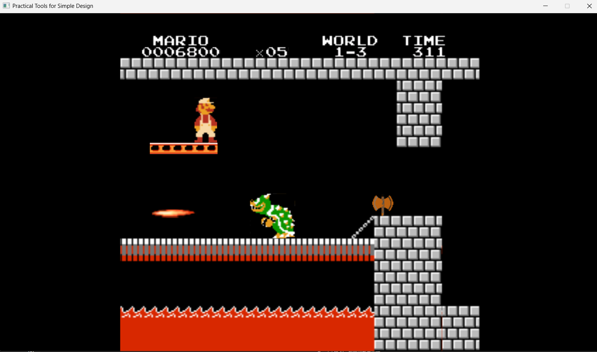
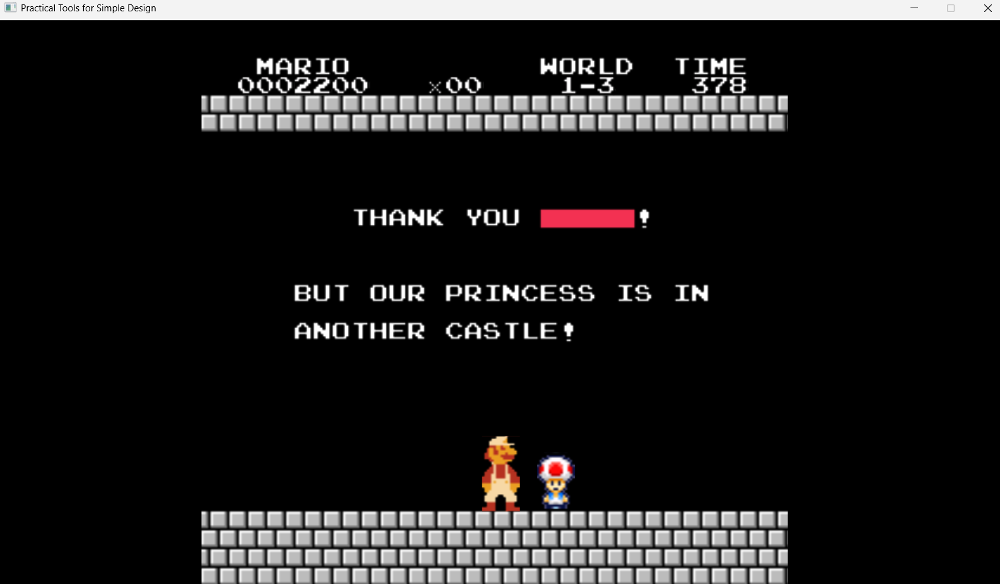

# 2026 OOPL Final Report

## 組別資訊

* **組別**：第 59 組
* **組員**：113590054 鄭愍翰、113590009 巫顯辰
* **復刻遊戲**：Super Mario Bros. (超級瑪利歐兄弟)

## 專案簡介

### 遊戲簡介
本專案使用 C++ 與物件導向程式設計架構，重現了 1985 年經典 NES 遊戲《超級瑪利歐兄弟》。專案中實作了經典的 1-1、1-3 關卡，以及 1-4 的庫巴城堡魔王戰（分別為遊戲中的 1-1、1-2、1-3 關）。遊戲包含了完整的物理跳躍機制、道具系統（香菇、火之花、無敵星星）、多種敵人（栗子寶寶、烏龜、庫巴、火柱），以及過關動畫與彩蛋文字。

### 組別分工
* **鄭愍翰 (113590054)**：
  * **全局與系統**：瑪利歐核心移動與物理邏輯、橫跨三關的數值算分方式與文字 UI 系統、跨關卡邏輯修改與 Bug 除錯。
  * **第一關**：地圖渲染、金幣系統、問號箱與道具箱系統開發。
  * **第二關**：進階機制開發（移動平台底層邏輯、飛天烏龜邏輯）、關卡怪物配置。
  * **第三關**：第三關專屬怪物（庫巴與火柱等）機制、最終過關文字彩蛋畫面實作。
* **巫顯辰 (113590009)**：
  * **全局與系統**：前期遊戲素材整理、跨關卡邏輯修改與 Bug 除錯、瑪利歐死亡後的關卡重置邏輯（包含道具與敵人狀態歸位）、作弊模式實作。
  * **第一關**：經典敵人（栗子寶寶、烏龜）運作邏輯、旗桿降落與進城堡過關動畫、跳關傳送邏輯。
  * **第二關**：地圖渲染、關卡物件精確配置（金幣、道具箱、問號箱、移動平台）、第二關過關動畫與傳送邏輯。
  * **第三關**：地圖渲染、關卡物件配置、第三關專屬道具箱、斧頭過關邏輯與動畫、奇諾比奧（Toad）互動機制。

## 遊戲介紹

### 遊戲規則
1. **基本操作**：使用 `A` / `D` 控制左右移動，`W` 進行跳躍，`S` 進行蹲下，`B` 鍵為衝刺 (Sprint)，空白鍵 (`SPACE`) 發射火球。
2. **道具升級**：
    * **香菇**：使瑪利歐變大，可抵擋一次傷害並破壞磚塊。
    * **火之花**：獲得發射火球的能力，可用於遠程擊敗敵人。
    * **無敵星星**：獲得短暫的無敵狀態與加速效果。
3. **過關條件**：
    * **1-1 & 1-2**：突破重重障礙，抵達終點並拉下旗桿。
    * **1-3 (Boss戰)**：閃避庫巴的火焰與場地火柱，可選擇使用 5 顆火球擊敗庫巴，或觸碰庫巴後方的鐵鎚破壞橋樑，解救奇諾比奧。

### 遊戲畫面

## 程式設計

### 程式架構
* **Game Loop 與狀態管理 (`App` class)**：負責控制遊戲的 Start、Update、End 狀態，管理關卡切換 (`SwitchLevel`) 以及所有場景物件的更新。
* **實體基底 (`Character` / `AnimatedCharacter`)**：所有會動的物件皆繼承此類別，負責處理貼圖、動畫幀數更新與渲染層級 (`Z-Index`)。
* **玩家狀態機 (`Player` class)**：將瑪利歐的狀態分離（Small, Big, Fire, Star, Dead, Changing），利用 `RefreshAnimations()` 動態切換對應的 Sprite 陣列，並獨立處理重力與加速度物理運算。
* **碰撞處理 (`CollisionHandler`)**：處理統一的 AABB (Axis-Aligned Bounding Box) 碰撞邏輯。
* **物件與敵人 (`Block`, `Goomba`, `Bowser`, `Fireball` 等)**：各自封裝專屬的 `Update` 行為與 `Interact` (與玩家互動) 邏輯。

### 程式技術
* **智慧指標 (Smart Pointers)**：全面使用 `std::shared_ptr` 與 `std::unique_ptr` 管理遊戲物件，避免切換關卡或物件銷毀時發生 Memory Leak。
* **相機偏移系統 (Camera Offset)**：以 `m_WorldOffset` 變數作為核心，動態計算世界座標與螢幕座標的轉換，實現鏡頭橫向卷軸推進。
* **自製 2D 物理推擠引擎 (Collision Resolution)**：不依賴外部物理庫，自行計算重疊深度 (Overlap) 並實作 X/Y 軸分離的推擠邏輯，解決角色卡牆問題。

### 使用到 AI/AI Agent 的部分
* **物理引擎邊界除錯**：在處理 2D 物理碰撞時，遇到嚴重的「卡磚縫 (Toe-stubbing)」與「大碰撞箱瞬移 (AABB Teleportation)」Bug。AI 提供了「分離碰撞箱」與「限制最大重疊推擠距離 (Overlap depth check)」的解決方案。
* **渲染時序優化**：解決怪物發射飛行物（如庫巴火球）時的「第一幀殘影 (First-Frame Glitch)」問題，透過 AI 建議在掛載至渲染樹前強制執行一次包含偏移量的 `Update(0.0f)` 計算。
* **過關腳本與動畫狀態**：協助重構複雜的過關動畫腳本，包含鏡頭鎖定解除 (`m_WorldOffset` 停止更新)、強制作動動畫，以及過關 UI 文字的精準絕對座標定位。

## 結語

### 問題與解決方法
* **問題一：瑪利歐走路時會被平坦的地板接縫絆倒（或火球撞地提早引爆）。**
    * **解決方法**：將負責判定水平撞牆的碰撞箱底部提高 (懸空約 8~12 像素)，與垂直落地的碰撞箱分離。確保物件在平地滑行時，不會誤觸下一個磚塊的側面邊緣。
* **問題二：角色落入大地板時會瞬間移動到畫面邊緣。**
    * **解決方法**：引入深度判定機制。當系統發現角色 X 軸需要被推擠的距離過大（例如大於 24 像素）時，判定其為「踩在地板上」而非「撞到牆壁」，進而忽略該次無效的水平推擠。
* **問題三：記憶體殘留導致換關時出現舊物件（如火柱、舊關卡的奇諾比奧）。**
    * **解決方法**：在 `SwitchLevel` 與 `ResetLevel` 中，嚴格實作清理機制，不僅清除陣列內容 (`.clear()`)，更確實呼叫 `m_Root.RemoveChild()` 將其從底層渲染樹中拔除。

### 自評

| 項次 | 項目 | 完成 |
| :--- | :--- | :---: |
| 1 | 這是範例 | V |
| 2 | 完成專案權限改為 public | |
| 3 | 具有 debug mode 的功能 | V |
| 4 | 解決專案上所有 Memory Leak 的問題 | V |
| 5 | 報告中沒有任何錯字，以及沒有任何一項遺漏 | V |
| 6 | 報告至少保持基本的美感，人類可讀 | V |

### 心得
這次的超級瑪利歐遊戲開發專案，由我（顯辰）與隊友（愍翰）共同合作完成。在整個開發週期中，我們兩人皆全程參與了跨關卡的邏輯修改與 Bug 除錯，確保遊戲的運作流暢。透過明確的分工，我們不僅完成了程式邏輯的撰寫，也兼顧了關卡的細節設計。以下是我們針對三個關卡的分工與心得總結：

**第一關：基礎系統與角色建置**
在第一關的開發中，我們專注於建立遊戲的核心基礎與視覺呈現。
* **我的部分**：主要負責前期大部分素材整理，並做了經典敵人的運作邏輯（香菇與烏龜）。此外，我做了完整的關卡輪迴系統，包含第一關旗子降落與走進城堡的過關動畫、過關後傳送至第二關的邏輯，以及瑪利歐死亡後回到原點時道具與敵人狀態的重置邏輯。
* **隊友的部分**：負責了第一關的地圖渲染，並做了瑪利歐的移動邏輯，以及金幣、問號箱與道具箱的系統。

**第二關：進階機制與關卡設計**
進入第二關後，我們引入了更多的互動元素，並在邏輯開發與地圖配置上進行了深度的交叉合作。
* **我的部分**：延續素材整理的工作，我負責第二關的地圖渲染，並在關卡中放金幣、放道具箱、放問號箱，以及放移動平台的位置。在程式邏輯方面，我做了作弊模式、第二關旗桿降落與進城堡動畫，以及傳送至第三關的邏輯。
* **隊友的部分**：他專注於進階機制的開發，做了移動平台的邏輯以及會飛的烏龜，並負責在關卡中放這些怪物。

**第三關：最終關卡與結局動畫**
在最後的城堡關卡中，我們致力於還原經典的魔王關卡氛圍。
* **我的部分**：負責第三關的地圖渲染，並在地圖上放問號箱、放金幣與放平台。為了符合城堡關卡的特性，我做了第三關專屬的道具箱，以及過關關鍵的斧頭邏輯——包含瑪利歐碰到斧頭後的過關動畫，還有走到 Toad 面前的互動。
* **隊友的部分**：他做了第三關專屬的怪物，以及最後過關的文字畫面。

**跨關卡系統與總結**
除了各關卡的獨立設計外，遊戲中橫跨三關的數值算分方式與文字，皆是由隊友製作完成。
回顧這次的開發過程，我們深刻體會到程式邏輯開發與關卡物件配置的緊密關聯。例如，由隊友做好移動平台的邏輯後，再由我來放確切的平台位置；我建構了基礎系統後，再由隊友來安排特定敵人。我們兩個都有修邏輯，互相信任彼此的程式碼。這次的合作不僅順利完成了三個關卡的開發，也讓我們對遊戲底層架構有了更紮實的實戰經驗。

### 貢獻比例
* 鄭愍翰：50%
* 巫顯辰：50%